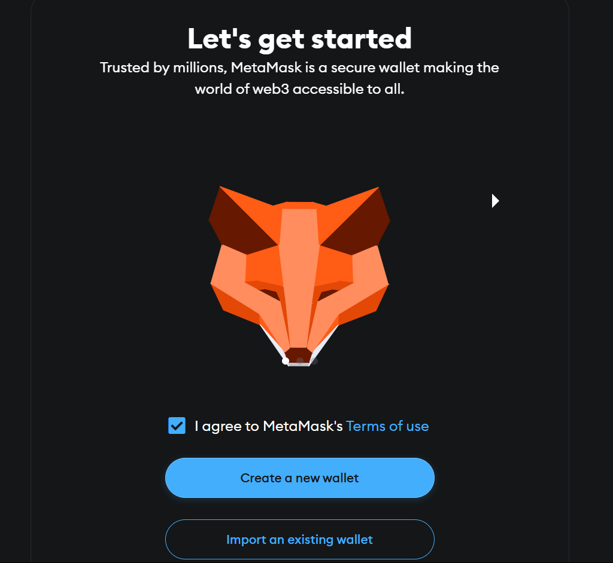

# IPFS Blockchain Assignment (Assignment 1)

This assignment explains how to install IPFS, start the daemon, upload a file, retrieve its CID, and push everything to a GitHub repository using WSL (Windows Subsystem for Linux).

## Steps Performed

### 1. IPFS Installation
Kubo (IPFS) version 0.32.1 was installed using the following commands:

```bash
wget https://dist.ipfs.tech/kubo/v0.32.1/kubo_v0.32.1_linux-amd64.tar.gz
tar -xvzf kubo_v0.32.1_linux-amd64.tar.gz
cd kubo
sudo bash install.sh
```

**Screenshot:** Installation completed and version verified using `ipfs --version`


---

### 2. IPFS Initialization
IPFS was initialized to generate the peer identity.

```bash
ipfs init
```

**Screenshot:** Output displaying the Peer ID and repository initialization message.


---

### 3. Running the IPFS Daemon
The IPFS daemon was started to initialize the node.

```bash
ipfs daemon
```

**Screenshot:** Daemon started successfully with WebUI and Gateway addresses.


---

### 4. Uploading a File to IPFS
A file named `hello.txt` was created and added to IPFS to generate its unique content identifier (CID).

```bash
echo "Hello from Lucky!" > hello.txt
ipfs add hello.txt
```

**Screenshot:** `hello.txt` uploaded and CID displayed in the terminal.


---

### 5. Creating CID File
The generated CID was saved in a new file named `ipfs_cid.txt`.

```bash
echo "QmbLWQTZZspap5tE5G4taxuRhqFJayDtge58cPFEvYFi1n" > ipfs_cid.txt
```

**Screenshot:** `ipfs_cid.txt` file created with the CID.


---

### 6. Git Configuration and GitHub Repository Setup
Git was initialized and configured. The project was committed and pushed to GitHub using the following steps:

```bash
git init
git config --global user.name "Lucky Longre"
git config --global user.email "sem1luckylongre@gmail.com"
git add .
git commit -m "Added IPFS CID file for Blockchain assignment"
git branch -M main
git remote add origin https://github.com/Sem1-LuckyLongre/blockchain-assignments.git
git push -u origin main# IPFS Blockchain Assignment

This assignment explains how to install IPFS, start the daemon, upload a file, retrieve its CID, and push everything to a GitHub repository using WSL (Windows Subsystem for Linux).

## Steps Performed

### 1. IPFS Installation
Kubo (IPFS) version 0.32.1 was installed using the following commands:

```bash
wget https://dist.ipfs.tech/kubo/v0.32.1/kubo_v0.32.1_linux-amd64.tar.gz
tar -xvzf kubo_v0.32.1_linux-amd64.tar.gz
cd kubo
sudo bash install.sh
```

**Screenshot:** Installation completed and version verified using `ipfs --version`


---

### 2. IPFS Initialization
IPFS was initialized to generate the peer identity.

```bash
ipfs init
```

**Screenshot:** Output displaying the Peer ID and repository initialization message.


---

### 3. Running the IPFS Daemon
The IPFS daemon was started to initialize the node.

```bash
ipfs daemon
```

**Screenshot:** Daemon started successfully with WebUI and Gateway addresses.


---

### 4. Uploading a File to IPFS
A file named `hello.txt` was created and added to IPFS to generate its unique content identifier (CID).

```bash
echo "Hello from Lucky!" > hello.txt
ipfs add hello.txt
```

**Screenshot:** `hello.txt` uploaded and CID displayed in the terminal.


---

### 5. Creating CID File
The generated CID was saved in a new file named `ipfs_cid.txt`.

```bash
echo "QmbLWQTZZspap5tE5G4taxuRhqFJayDtge58cPFEvYFi1n" > ipfs_cid.txt
```

**Screenshot:** `ipfs_cid.txt` file created with the CID.


---

### 6. Git Configuration and GitHub Repository Setup
Git was initialized and configured. The project was committed and pushed to GitHub using the following steps:

```bash
git init
git config --global user.name "Lucky Longre"
git config --global user.email "sem1luckylongre@gmail.com"
git add .
git commit -m "Added IPFS CID file for Blockchain assignment"
git branch -M main
git remote add origin https://github.com/Sem1-LuckyLongre/blockchain-assignments.git
git push -u origin main
```

**Screenshot:** Files successfully committed and pushed to GitHub.


---

### 7. GitHub Repository View
The pushed files were verified on the GitHub repository page.

**Screenshot:** Repository contains `hello.txt` and `ipfs_cid.txt`.


---

## Conclusion
The assignment successfully covered the installation and execution of IPFS, file upload, CID retrieval, and GitHub integration through WSL.

**GitHub Repository**: [blockchain-assignments](https://github.com/Sem2-LuckyLongre/blockchain_assignment_1)

**View file on IPFS Gateway**:  
[https://ipfs.io/ipfs/QmbLWQTZZspap5tE5G4taxuRhqFJayDtge58cPFEvYFi1n](https://ipfs.io/ipfs/QmbLWQTZZspap5tE5G4taxuRhqFJayDtge58cPFEvYFi1n)


**Screenshot:** Files successfully committed and pushed to GitHub.


---

### 7. GitHub Repository View
The pushed files were verified on the GitHub repository page.

**Screenshot:** Repository contains `hello.txt` and `ipfs_cid.txt`.


---

## Conclusion
The assignment successfully covered the installation and execution of IPFS, file upload, CID retrieval, and GitHub integration through WSL.

**GitHub Repository**: [blockchain-assignments](https://github.com/Sem2-LuckyLongre/blockchain_assignment_1)

**View file on IPFS Gateway**:  
[https://ipfs.io/ipfs/QmbLWQTZZspap5tE5G4taxuRhqFJayDtge58cPFEvYFi1n](https://ipfs.io/ipfs/QmbLWQTZZspap5tE5G4taxuRhqFJayDtge58cPFEvYFi1n)


---

# Hyperledger Fabric Test Network Setup (Assignment 2)

This project explains how to set up and run a basic Hyperledger Fabric test network using its official sample repository. It includes installing the required tools, downloading the Fabric samples, and using the `network.sh` script.

---

## Prerequisites Installation

### 1. Install Go (Golang)
Go is needed to build Fabric binaries.

```bash
sudo apt install golang-go
```

**Screenshot:**


---

### 2. Check Docker Installation

```bash
docker --version
```

**Screenshot:**


---

### 3. Check Docker Compose Installation

```bash
docker-compose --version
```

**Screenshot:**


---

### 4. Verify Directory Structure

Check the current directory structure:

```bash
ls
```

**Screenshot:**


---

## Cloning Fabric Samples

### 5. Clone the Fabric Samples Repository

```bash
git clone -b main https://github.com/hyperledger/fabric-samples.git
```

**Screenshot:**


---

### 6. Go to the Fabric Samples Directory

```bash
cd fabric-samples
```

**Screenshot:**


---

### 7. Download Binaries and Docker Images

```bash
curl -sSL https://bit.ly/2ysbOFE | bash -s
```

**Screenshot:**


---

## Running the Test Network

### 8. Navigate to the Test Network Folder

```bash
cd test-network
```

---

### 9. Start the Network

```bash
./network.sh up
```

**Screenshot:**


---

### 10. Create a Channel

```bash
./network.sh createChannel
```

**Screenshot:**


---

### 11. Shut Down the Network

```bash
./network.sh down
```

**Screenshot:**


---

## Conclusion

This setup shows how to install tools and run a basic Hyperledger Fabric test network. It includes starting the network, creating a channel, and stopping everything afterward.

---


# IPFS Privacy and Encryption – Command Line Assignment (Assignment 3)

This project explains how to securely upload, encrypt, decrypt, and manage file privacy using **IPFS (InterPlanetary File System)** and **OpenSSL** via the command line.

---

## Objective

The aim is to learn how to:
- Add files to IPFS
- Encrypt files using AES-256 (OpenSSL)
- Decrypt encrypted files
- Store data privately on a decentralized file system

---

## Steps

### Step 1: Create a file with sample text
```bash
echo "Hello, IPFS!" > myfile.txt
```


---

### Step 2: Add the original file to IPFS
```bash
ipfs add myfile.txt
```


---

### Step 3: Encrypt the file with AES-256-CBC using OpenSSL
```bash
openssl enc -aes-256-cbc -pbkdf2 -iter 100000 -salt -in myfile.txt -out myfile_encrypted.txt -pass pass:Lucky@123
```


---

### Step 4: Upload the encrypted file to IPFS
```bash
ipfs add myfile_encrypted.txt
```


---

### Step 5: View the encrypted file
```bash
cat myfile_encrypted.txt
```


---

### Step 6: Decrypt the file using the same password
```bash
openssl enc -d -aes-256-cbc -pbkdf2 -iter 100000 -in myfile_encrypted.txt -out decrypted_file.txt -pass pass:Lucky@123
```


---

### Step 7: Check the decrypted content
```bash
cat decrypted_file.txt
```


---

### Step 8: Upload the decrypted file to IPFS again
```bash
ipfs add decrypted_file.txt
```


---

## Conclusion

This task shows how to:
- Encrypt data before storing it on IPFS
- Use strong encryption to protect access
- Verify integrity by decrypting and comparing files
- Understand content-based addressing in IPFS

> **Note:** Always keep your encryption password secure to protect your data on decentralized platforms.

---

# MetaMask & Sepolia Test ETH Assignment (Assignment 4)

## Overview
This document explains how to use MetaMask with the Ethereum Sepolia Test Network. It includes steps for setting up MetaMask, configuring the Sepolia network, receiving test ETH from the Google Cloud Faucet, and transferring ETH between two accounts. This helps in understanding blockchain wallets, test networks, and transactions.

---

## Step 1: Create a MetaMask Wallet
To begin, a crypto wallet is needed. MetaMask is a widely used Ethereum wallet available as a browser extension.

### What Was Done:
- Installed the MetaMask browser extension.
- Created a new wallet.
- Saved the Secret Recovery Phrase securely.

### Screenshots:
1. MetaMask Download Page  
   
2. Create Wallet Screen  
   
3. Secret Recovery Phrase  
   
4. Wallet Homepage  
   

*Note: Never share your recovery phrase with anyone.*

---

## Step 2: Add the Sepolia Test Network
Since the Ethereum mainnet uses real ETH, test networks like Sepolia are used for practice.

### What Was Done:
- Opened MetaMask network settings.
- Selected or added the Sepolia Test Network.
- Switched from Ethereum mainnet to Sepolia.

### Screenshots:
1. Network Dropdown List  
   
2. Add Network Screen  
   
3. Sepolia Added Successfully  
   

*Note: Using test networks allows learning without using real money.*

---

## Step 3: Get Sepolia ETH from Faucet
Test ETH is required to simulate transactions.

### What Was Done:
- Visited the Google Cloud Faucet site.
- Pasted MetaMask wallet address.
- Clicked on "Request Tokens".
- Verified token receipt in MetaMask.

### Screenshots:
1. Faucet Homepage  
   
2. Request Tokens Clicked  
   
3. Drip Confirmation  
   
4. ETH Received in MetaMask  
   

*Note: Sepolia ETH is only for testing purposes and has no real value.*

---

## Step 4: Transfer Sepolia ETH Between Accounts
To simulate a real transaction, ETH was sent from one account to another.

### What Was Done:
- Created a second MetaMask account.
- Copied the new account's address.
- Used the first account to send 0.01 ETH to the second account.
- Verified the transfer.

### Screenshots:
1. Create Second Account  
   
2. Copy Receiver Address  
   
3. Send ETH from First Account  
   
4. Transaction Confirmation  
   
5. ETH Received in Second Account  
   

*Note: This simulates how blockchain transactions work.*

---

## Conclusion
This exercise demonstrated how to:
- Create and manage a MetaMask wallet
- Connect to a test network (Sepolia)
- Request and use test ETH
- Send ETH between accounts

These steps build a basic understanding of Ethereum wallets, testnets, and transactions in a development environment.

> **Learning Outcome:** Practical experience with wallets, test ETH, and network setup prepares users for blockchain development and testing.

---
