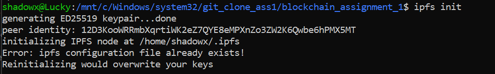

# IPFS Blockchain Assignment (Assignment 1)

This assignment explains how to install IPFS, start the daemon, upload a file, retrieve its CID, and push everything to a GitHub repository using WSL (Windows Subsystem for Linux).

## Steps Performed

### 1. IPFS Installation
Kubo (IPFS) version 0.32.1 was installed using the following commands:

```bash
wget https://dist.ipfs.tech/kubo/v0.32.1/kubo_v0.32.1_linux-amd64.tar.gz
tar -xvzf kubo_v0.32.1_linux-amd64.tar.gz
cd kubo
sudo bash install.sh
```

**Screenshot:** Installation completed and version verified using `ipfs --version`


---

### 2. IPFS Initialization
IPFS was initialized to generate the peer identity.

```bash
ipfs init
```

**Screenshot:** Output displaying the Peer ID and repository initialization message.



---

### 3. Running the IPFS Daemon
The IPFS daemon was started to initialize the node.

```bash
ipfs daemon
```

**Screenshot:** Daemon started successfully with WebUI and Gateway addresses.


---

### 4. Uploading a File to IPFS
A file named `hello.txt` was created and added to IPFS to generate its unique content identifier (CID).

```bash
echo "Hello from Lucky!" > hello.txt
ipfs add hello.txt
```

**Screenshot:** `hello.txt` uploaded and CID displayed in the terminal.


---

### 5. Creating CID File
The generated CID was saved in a new file named `ipfs_cid.txt`.

```bash
echo "QmbLWQTZZspap5tE5G4taxuRhqFJayDtge58cPFEvYFi1n" > ipfs_cid.txt
```

**Screenshot:** `ipfs_cid.txt` file created with the CID.


---

### 6. Git Configuration and GitHub Repository Setup
Git was initialized and configured. The project was committed and pushed to GitHub using the following steps:

```bash
git init
git config --global user.name "Lucky Longre"
git config --global user.email "sem1luckylongre@gmail.com"
git add .
git commit -m "Added IPFS CID file for Blockchain assignment"
git branch -M main
git remote add origin https://github.com/Sem1-LuckyLongre/blockchain-assignments.git
git push -u origin main# IPFS Blockchain Assignment

This assignment explains how to install IPFS, start the daemon, upload a file, retrieve its CID, and push everything to a GitHub repository using WSL (Windows Subsystem for Linux).

## Steps Performed

### 1. IPFS Installation
Kubo (IPFS) version 0.32.1 was installed using the following commands:

```bash
wget https://dist.ipfs.tech/kubo/v0.32.1/kubo_v0.32.1_linux-amd64.tar.gz
tar -xvzf kubo_v0.32.1_linux-amd64.tar.gz
cd kubo
sudo bash install.sh
```

**Screenshot:** Installation completed and version verified using `ipfs --version`


---

### 2. IPFS Initialization
IPFS was initialized to generate the peer identity.

```bash
ipfs init
```

**Screenshot:** Output displaying the Peer ID and repository initialization message.


---

### 3. Running the IPFS Daemon
The IPFS daemon was started to initialize the node.

```bash
ipfs daemon
```

**Screenshot:** Daemon started successfully with WebUI and Gateway addresses.


---

### 4. Uploading a File to IPFS
A file named `hello.txt` was created and added to IPFS to generate its unique content identifier (CID).

```bash
echo "Hello from Lucky!" > hello.txt
ipfs add hello.txt
```

**Screenshot:** `hello.txt` uploaded and CID displayed in the terminal.


---

### 5. Creating CID File
The generated CID was saved in a new file named `ipfs_cid.txt`.

```bash
echo "QmbLWQTZZspap5tE5G4taxuRhqFJayDtge58cPFEvYFi1n" > ipfs_cid.txt
```

**Screenshot:** `ipfs_cid.txt` file created with the CID.


---

### 6. Git Configuration and GitHub Repository Setup
Git was initialized and configured. The project was committed and pushed to GitHub using the following steps:

```bash
git init
git config --global user.name "Lucky Longre"
git config --global user.email "sem1luckylongre@gmail.com"
git add .
git commit -m "Added IPFS CID file for Blockchain assignment"
git branch -M main
git remote add origin https://github.com/Sem1-LuckyLongre/blockchain-assignments.git
git push -u origin main
```

**Screenshot:** Files successfully committed and pushed to GitHub.


---

### 7. GitHub Repository View
The pushed files were verified on the GitHub repository page.

**Screenshot:** Repository contains `hello.txt` and `ipfs_cid.txt`.


---

## Conclusion
The assignment successfully covered the installation and execution of IPFS, file upload, CID retrieval, and GitHub integration through WSL.

**GitHub Repository**: [blockchain-assignments](https://github.com/Sem2-LuckyLongre/blockchain_assignment_1)

**View file on IPFS Gateway**:  
[https://ipfs.io/ipfs/QmbLWQTZZspap5tE5G4taxuRhqFJayDtge58cPFEvYFi1n](https://ipfs.io/ipfs/QmbLWQTZZspap5tE5G4taxuRhqFJayDtge58cPFEvYFi1n)


**Screenshot:** Files successfully committed and pushed to GitHub.


---

### 7. GitHub Repository View
The pushed files were verified on the GitHub repository page.

**Screenshot:** Repository contains `hello.txt` and `ipfs_cid.txt`.


---

## Conclusion
The assignment successfully covered the installation and execution of IPFS, file upload, CID retrieval, and GitHub integration through WSL.

**GitHub Repository**: [blockchain-assignments](https://github.com/Sem2-LuckyLongre/blockchain_assignment_1)

**View file on IPFS Gateway**:  
[https://ipfs.io/ipfs/QmbLWQTZZspap5tE5G4taxuRhqFJayDtge58cPFEvYFi1n](https://ipfs.io/ipfs/QmbLWQTZZspap5tE5G4taxuRhqFJayDtge58cPFEvYFi1n)


---

# Hyperledger Fabric Test Network Setup (Assignment 2)

This project explains how to set up and run a basic Hyperledger Fabric test network using its official sample repository. It includes installing the required tools, downloading the Fabric samples, and using the `network.sh` script.

---

## Prerequisites Installation

### 1. Install Go (Golang)
Go is needed to build Fabric binaries.

```bash
sudo apt install golang-go
```

**Screenshot:**


---

### 2. Check Docker Installation

```bash
docker --version
```

**Screenshot:**


---

### 3. Check Docker Compose Installation

```bash
docker-compose --version
```

**Screenshot:**


---

### 4. Verify Directory Structure

Check the current directory structure:

```bash
ls
```

**Screenshot:**


---

## Cloning Fabric Samples

### 5. Clone the Fabric Samples Repository

```bash
git clone -b main https://github.com/hyperledger/fabric-samples.git
```

**Screenshot:**


---

### 6. Go to the Fabric Samples Directory

```bash
cd fabric-samples
```

**Screenshot:**


---

### 7. Download Binaries and Docker Images

```bash
curl -sSL https://bit.ly/2ysbOFE | bash -s
```

**Screenshot:**


---

## Running the Test Network

### 8. Navigate to the Test Network Folder

```bash
cd test-network
```

---

### 9. Start the Network

```bash
./network.sh up
```

**Screenshot:**


---

### 10. Create a Channel

```bash
./network.sh createChannel
```

**Screenshot:**


---

### 11. Shut Down the Network

```bash
./network.sh down
```

**Screenshot:**


---

## Conclusion

This setup shows how to install tools and run a basic Hyperledger Fabric test network. It includes starting the network, creating a channel, and stopping everything afterward.

---


# IPFS Privacy and Encryption – Command Line Assignment (Assignment 3)

This project explains how to securely upload, encrypt, decrypt, and manage file privacy using **IPFS (InterPlanetary File System)** and **OpenSSL** via the command line.

---

## Objective

The aim is to learn how to:
- Add files to IPFS
- Encrypt files using AES-256 (OpenSSL)
- Decrypt encrypted files
- Store data privately on a decentralized file system

---

## Steps

### Step 1: Create a file with sample text
```bash
echo "Hello, IPFS!" > myfile.txt
```


---

### Step 2: Add the original file to IPFS
```bash
ipfs add myfile.txt
```


---

### Step 3: Encrypt the file with AES-256-CBC using OpenSSL
```bash
openssl enc -aes-256-cbc -pbkdf2 -iter 100000 -salt -in myfile.txt -out myfile_encrypted.txt -pass pass:Lucky@123
```


---

### Step 4: Upload the encrypted file to IPFS
```bash
ipfs add myfile_encrypted.txt
```


---

### Step 5: View the encrypted file
```bash
cat myfile_encrypted.txt
```


---

### Step 6: Decrypt the file using the same password
```bash
openssl enc -d -aes-256-cbc -pbkdf2 -iter 100000 -in myfile_encrypted.txt -out decrypted_file.txt -pass pass:Lucky@123
```


---

### Step 7: Check the decrypted content
```bash
cat decrypted_file.txt
```


---

### Step 8: Upload the decrypted file to IPFS again
```bash
ipfs add decrypted_file.txt
```


---

## Conclusion

This task shows how to:
- Encrypt data before storing it on IPFS
- Use strong encryption to protect access
- Verify integrity by decrypting and comparing files
- Understand content-based addressing in IPFS

> **Note:** Always keep your encryption password secure to protect your data on decentralized platforms.

---

# MetaMask & Sepolia Test ETH Assignment (Assignment 4)

## Overview
This document explains how to use MetaMask with the Ethereum Sepolia Test Network. It includes steps for setting up MetaMask, configuring the Sepolia network, receiving test ETH from the Google Cloud Faucet, and transferring ETH between two accounts. This helps in understanding blockchain wallets, test networks, and transactions.

---

## Step 1: Create a MetaMask Wallet
To begin, a crypto wallet is needed. MetaMask is a widely used Ethereum wallet available as a browser extension.

### What Was Done:
- Installed the MetaMask browser extension.
- Created a new wallet.
- Saved the Secret Recovery Phrase securely.

### Screenshots:
1. MetaMask Download Page  
   
2. Create Wallet Screen  
   
3. Secret Recovery Phrase  
   
4. Wallet Homepage  
   

*Note: Never share your recovery phrase with anyone.*

---

## Step 2: Add the Sepolia Test Network
Since the Ethereum mainnet uses real ETH, test networks like Sepolia are used for practice.

### What Was Done:
- Opened MetaMask network settings.
- Selected or added the Sepolia Test Network.
- Switched from Ethereum mainnet to Sepolia.

### Screenshots:
1. Network Dropdown List  
   
2. Add Network Screen  
   
3. Sepolia Added Successfully  
   

*Note: Using test networks allows learning without using real money.*

---

## Step 3: Get Sepolia ETH from Faucet
Test ETH is required to simulate transactions.

### What Was Done:
- Visited the Google Cloud Faucet site.
- Pasted MetaMask wallet address.
- Clicked on "Request Tokens".
- Verified token receipt in MetaMask.

### Screenshots:
1. Faucet Homepage  
   
2. Request Tokens Clicked  
   
3. Drip Confirmation  
   
4. ETH Received in MetaMask  
   

*Note: Sepolia ETH is only for testing purposes and has no real value.*

---

## Step 4: Transfer Sepolia ETH Between Accounts
To simulate a real transaction, ETH was sent from one account to another.

### What Was Done:
- Created a second MetaMask account.
- Copied the new account's address.
- Used the first account to send 0.01 ETH to the second account.
- Verified the transfer.

### Screenshots:
1. Create Second Account  
   
2. Copy Receiver Address  
   
3. Send ETH from First Account  
   
4. Transaction Confirmation  
   
5. ETH Received in Second Account  
   

*Note: This simulates how blockchain transactions work.*

---

## Conclusion
This exercise demonstrated how to:
- Create and manage a MetaMask wallet
- Connect to a test network (Sepolia)
- Request and use test ETH
- Send ETH between accounts

These steps build a basic understanding of Ethereum wallets, testnets, and transactions in a development environment.

> **Learning Outcome:** Practical experience with wallets, test ETH, and network setup prepares users for blockchain development and testing.

---


## Voting System in Solidity (Assignment 5)

---

### Objective:

To create a decentralized voting system using a smart contract on the Ethereum blockchain where:

* Multiple candidates can be voted for.
* Each Ethereum address is allowed to vote **only once**.

---

### Technologies Used:

* **Solidity** (Smart Contract Language)
* **Remix IDE** (Online Solidity Compiler & Deployer)
* **MetaMask** (for address-based testing - optional)

---

### Smart Contract Features:

1. **Multiple Candidates**
   Candidates are initialized at the time of contract deployment.

2. **One Vote per Address**
   A voter can vote only once. The contract keeps track of voters using their address.

3. **Vote Counting**
   The system counts the number of votes received by each candidate.

4. **Public Access**
   Anyone can read the number of votes each candidate has received.

---

### Contract Code:

```solidity
// SPDX-License-Identifier: MIT
pragma solidity ^0.8.0;

contract VotingSystem {
    address public owner;
    string[] public candidateList;
    mapping(string => uint256) public votesReceived;
    mapping(address => bool) public hasVoted;

    constructor(string[] memory candidateNames) {
        owner = msg.sender;
        candidateList = candidateNames;
    }

    function vote(string memory candidate) public {
        require(!hasVoted[msg.sender], "You have already voted!");
        require(validCandidate(candidate), "Candidate does not exist!");

        votesReceived[candidate] += 1;
        hasVoted[msg.sender] = true;
    }

    function getVotes(string memory candidate) public view returns (uint256) {
        require(validCandidate(candidate), "Candidate does not exist!");
        return votesReceived[candidate];
    }

    function validCandidate(string memory candidate) internal view returns (bool) {
        for (uint i = 0; i < candidateList.length; i++) {
            if (keccak256(bytes(candidateList[i])) == keccak256(bytes(candidate))) {
                return true;
            }
        }
        return false;
    }

    function totalCandidates() public view returns (uint256) {
        return candidateList.length;
    }
}
```

---

### Steps to Deploy (Using Remix IDE):

1. Open [https://remix.ethereum.org](https://remix.ethereum.org).
2. Create a new file named `VotingSystem.sol` and paste the above code.
3. Compile the code using the **Solidity Compiler** tab.
4. Go to the **Deploy & Run** tab:

   * In the constructor input, pass candidate names like:
     `["Alice", "Bob", "Charlie"]`
   * Click **Deploy**.

---

### Sample Function Usage:

* `vote("Alice")` — Cast your vote to Alice.
* `getVotes("Alice")` — See total votes for Alice.
* `totalCandidates()` — Get the number of candidates.

---

### Expected Output:

* Only one vote per address is allowed.
* Invalid candidate names will be rejected.
* Vote counts will update in real-time.

---

### Conclusion:

This practical demonstrates how blockchain can provide transparency and trust in voting systems. With Solidity, we ensure fair voting by limiting users to a single vote and publicly exposing real-time results.

---


## Student Records in Solidity (Assignment 6)

### Objective:

To create a decentralized student record system using a smart contract on the Ethereum blockchain where:

- Multiple student records (name and roll number) can be stored.
- Users can add new student records.
- Anyone can retrieve student data by index.


### Technologies Used:

- **Solidity** (Smart Contract Language)
- **Remix IDE** (Online Solidity Compiler & Deployer)
- **MetaMask** (for address-based testing - optional)


### Smart Contract Features:

1. **Student Structure**: Each student has a `name` and `roll number`.
2. **Dynamic Storage**: New student records can be added anytime.
3. **Public Access**: Anyone can retrieve a student record or check the total number of students.
4. **Event Emission**: Emits an event when a student is added.


### Contract Code:
```solidity
// SPDX-License-Identifier: MIT
pragma solidity ^0.8.0;

contract StudentRecords {

    struct Student {
        string name;
        uint rollNumber;
    }

    Student[] public students;

    // Event for logging added students
    event StudentAdded(string name, uint rollNumber);

    // Function to add a new student
    function addStudent(string memory _name, uint _rollNumber) public {
        students.push(Student(_name, _rollNumber));
        emit StudentAdded(_name, _rollNumber);
    }

    // Function to get a student by index
    function getStudent(uint index) public view returns (string memory, uint) {
        require(index < students.length, "Invalid index");
        Student memory s = students[index];
        return (s.name, s.rollNumber);
    }

    // Function to get the total number of students
    function getTotalStudents() public view returns (uint) {
        return students.length;
    }
}
```


### Steps to Deploy (Using Remix IDE):

1. Open [https://remix.ethereum.org](https://remix.ethereum.org/)
2. Create a new file named `StudentRecords.sol` and paste the above code.
3. Compile the code using the **Solidity Compiler** tab.
4. Go to the **Deploy & Run Transactions** tab and click **Deploy**.


### Sample Function Usage:

- `addStudent("Lucky", 101)` — Adds a student named Lucky with roll number 101.
- `getStudent(0)` — Retrieves the first student’s data.
- `getTotalStudents()` — Returns the total number of students added.


### Expected Output:

- Users can add unlimited student records.
- Retrieval of student data by index.
- Real-time view of total students.


### Conclusion:

This smart contract shows how blockchain can help securely store and manage student records in a transparent and decentralized manner. Anyone can view and add data, and all changes are recorded immutably.


The contract and documentation have been updated to follow the structured format similar to your voting system example. You're ready to push this to GitHub. Let me know if you want help with Git commands or creating a GitHub repo.

---


## Owner-Only Access in Solidity (Asssignment 7)

### Objective:

To create a Solidity smart contract where:

- Only the deployer (owner) of the contract is allowed to call a specific function.
- Use of Solidity **modifiers** to implement access control.


### Technologies Used:

- **Solidity** (Smart Contract Language)
- **Remix IDE** (Online Solidity Compiler & Deployer)
- **MetaMask** (for address-based testing - optional)


### Smart Contract Features:

1. **Owner Identification**: Stores the deployer’s address as the contract owner.
2. **Access Restriction**: Uses a `modifier` to restrict certain function(s) to the owner only.
3. **Secure Execution**: Unauthorized users cannot execute restricted functions.


### Contract Code:
```solidity
// SPDX-License-Identifier: MIT
pragma solidity ^0.8.0;

contract OwnerOnlyFunction {

    address public owner;

    // Set the deployer as the owner
    constructor() {
        owner = msg.sender;
    }

    // Modifier to restrict access to only the owner
    modifier onlyOwner() {
        require(msg.sender == owner, "Access denied: Only owner can call this function.");
        _;
    }

    // Function only the owner can call
    function secretFunction() public onlyOwner {
        // logic only owner can execute
    }
}
```


### Steps to Deploy (Using Remix IDE):

1. Open [https://remix.ethereum.org](https://remix.ethereum.org/)
2. Create a new file named `OwnerOnlyFunction.sol` and paste the above code.
3. Compile the code using the **Solidity Compiler** tab.
4. Go to the **Deploy & Run Transactions** tab and click **Deploy**.


### Sample Function Usage:

- `secretFunction()` — Only callable by the contract owner.


### Expected Output:

- If the function is called by anyone other than the deployer (owner), the contract will throw an error: `Access denied: Only owner can call this function.`


### Conclusion:

This contract demonstrates how to implement role-based access control in smart contracts using **modifiers**, ensuring secure execution of sensitive functions by the owner only.


---

## Ether Donation Tracker in Solidity (Assignment 8)

### Objective:

To create a Solidity smart contract where:

- Anyone can donate Ether to the contract.
- The contract tracks and updates the **top 3 donors** based on the total amount donated.


### Technologies Used:

- **Solidity** (Smart Contract Language)
- **Remix IDE** (Online Solidity Compiler & Deployer)
- **MetaMask** (for sending Ether transactions)


### Smart Contract Features:

1. **Donation Function**: Users can send Ether to the contract using a function.
2. **Tracking Donations**: Maintains a record of each address's total donated amount.
3. **Top Donors List**: Dynamically updates the top 3 highest contributors.
4. **Read Functions**: View current top donors and their contribution amounts.


### Contract Code:
```solidity
// SPDX-License-Identifier: MIT
pragma solidity ^0.8.0;

contract TopDonors {
    mapping(address => uint) public donations;

    address[3] public topDonors;
    uint[3] public topAmounts;

    // Donate Ether to the contract
    function donate() public payable {
        require(msg.value > 0, "Donation must be greater than 0");
        
        donations[msg.sender] += msg.value;

        // Check if donor enters the top 3
        for (uint i = 0; i < 3; i++) {
            if (donations[msg.sender] > topAmounts[i]) {
                // Shift lower-ranked donors
                for (uint j = 2; j > i; j--) {
                    topDonors[j] = topDonors[j - 1];
                    topAmounts[j] = topAmounts[j - 1];
                }
                // Insert new top donor
                topDonors[i] = msg.sender;
                topAmounts[i] = donations[msg.sender];
                break;
            }
        }
    }

    // View function to get top donors and amounts
    function getTopDonors() public view returns (address[3] memory, uint[3] memory) {
        return (topDonors, topAmounts);
    }

    // Get the contract's balance
    function getContractBalance() public view returns (uint) {
        return address(this).balance;
    }
}
```


### Steps to Deploy (Using Remix IDE):

1. Open [https://remix.ethereum.org](https://remix.ethereum.org/)
2. Create a new file named `TopDonors.sol` and paste the above code.
3. Compile using the **Solidity Compiler** tab.
4. In the **Deploy & Run Transactions** tab, deploy the contract.


### Sample Function Usage:

- `donate()` — Use the VALUE field in Remix to send Ether.
- `getTopDonors()` — Returns the top 3 donor addresses and their respective amounts.
- `getContractBalance()` — Shows the total Ether held by the contract.


### Expected Output:

- Donation amounts update correctly.
- Top 3 donor list is dynamically maintained.
- Anyone can view the leaderboard.


### Conclusion:

This contract demonstrates a leaderboard-style implementation using Solidity. It promotes transparent and gamified Ether donation tracking on the Ethereum blockchain.

---


## Simple Auction System in Solidity (Assignment 9)

### Objective:

To implement a basic auction contract where:

- Users can place bids by sending Ether.
- The contract keeps track of the highest bid and bidder.
- The auction can be ended by the owner.


### Technologies Used:

- **Solidity** (Smart Contract Language)
- **Remix IDE** (Online Solidity Compiler & Deployer)
- **MetaMask** (for interacting with the contract)


### Smart Contract Features:

1. **Placing Bids**: Users can place bids with Ether. Bids must be higher than the current highest bid.
2. **Tracking Top Bidder**: Stores the address and amount of the highest bidder.
3. **End Auction**: Only the owner can end the auction and transfer funds.
4. **Refunding Previous Highest Bidder**: Automatically refunds the previous highest bid when outbid.


### Contract Code:
```solidity
// SPDX-License-Identifier: MIT
pragma solidity ^0.8.0;

contract SimpleAuction {
    address public owner;
    address public highestBidder;
    uint public highestBid;
    bool public auctionEnded;

    mapping(address => uint) public pendingReturns;

    constructor() {
        owner = msg.sender;
    }

    // Place a bid
    function bid() public payable {
        require(!auctionEnded, "Auction already ended.");
        require(msg.value > highestBid, "There already is a higher bid.");

        if (highestBid != 0) {
            // Refund the previous highest bidder
            pendingReturns[highestBidder] += highestBid;
        }

        highestBidder = msg.sender;
        highestBid = msg.value;
    }

    // Withdraw overbid amounts
    function withdraw() public returns (bool) {
        uint amount = pendingReturns[msg.sender];
        require(amount > 0, "No funds to withdraw.");

        pendingReturns[msg.sender] = 0;

        if (!payable(msg.sender).send(amount)) {
            pendingReturns[msg.sender] = amount;
            return false;
        }
        return true;
    }

    // End the auction
    function endAuction() public {
        require(msg.sender == owner, "Only owner can end the auction.");
        require(!auctionEnded, "Auction already ended.");

        auctionEnded = true;
        payable(owner).transfer(highestBid);
    }
}
```


### Steps to Deploy (Using Remix IDE):

1. Go to [https://remix.ethereum.org](https://remix.ethereum.org/)
2. Create a new file named `SimpleAuction.sol` and paste the code above.
3. Compile it using **Solidity Compiler**.
4. Deploy it using the **Deploy & Run Transactions** tab.


### Sample Function Usage:

- `bid()` — Place a bid by entering Ether value in the VALUE field.
- `withdraw()` — Previous bidders can withdraw their funds.
- `endAuction()` — Owner ends the auction and receives the highest bid.


### Expected Output:

- Only higher bids are accepted.
- Previous top bidders are refunded.
- Owner can end the auction and receive funds.


### Conclusion:

This basic auction contract enables transparent and competitive bidding. Solidity ensures secure bid handling, automatic refunds, and owner-controlled auction finalization.

---
